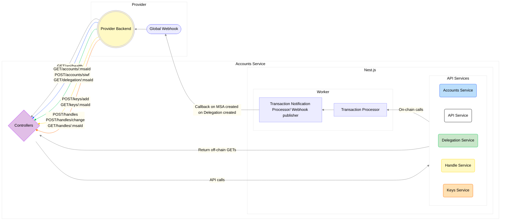

# Account Service

<!-- TABLE OF CONTENTS -->

# 📗 Table of Contents

- [📖 About the Project](#about-project)
- [🔍 Arch Map](#-arch-maps)
- [🛠 Built With](#-built-with)
    - [Tech Stack](#tech-stack)
    - [Key Features](#key-features)
- [🚀 Live OpenAPI Docs](#-live-docs)
- [💻 Getting Started](#-getting-started)
    - [Prerequisites](#prerequisites)
    - [Setup](#setup)
    - [Install](#install)
    - [Usage](#usage)
    - [Run tests](#run-tests)
- [🤝 Contributing](#-contributing)
- [⭐️ Show your support](#-support)
- [❓FAQ](#faq)
- [📝 License](#-license)

<!-- PROJECT DESCRIPTION -->

# 📖 `account-service` <a name="about-project"></a>

Account Service is a service enabling easy interaction with [DSNP](https://dsnp.org/) accounts on [Frequency](https://docs.frequency.xyz/).

<!-- Mermaid Arch maps -->

## 🔭 Arch Maps

The account-service is a NestJS application that is split into two main parts: the API and the Worker.

The API is responsible for handling incoming HTTP requests and the Worker is responsible for processing jobs that require blockchain interaction.



<p align="right">(<a href="#-table-of-contents">back to top</a>)</p>

## 🛠 Built With <a name="built-with"></a>

### Tech Stack <a name="tech-stack"></a>

<details>
  <summary>Framework</summary>
  <ul>
    <li><a href="https://nestjs.com/">NestJS</a></li>
  </ul>
</details>

<details>
  <summary>Language</summary>
  <ul>
    <li><a href="https://www.typescriptlang.org/">Typescript</a></li>
  </ul>
</details>

<details>
  <summary>Testing Libraries</summary>
  <ul>
    <li><a href="https://jestjs.io/">Jest</a></li>
    <li><a href="https://www.npmjs.com/package/supertest">Supertest</a></li>
  </ul>
</details>

<details>
  <summary>Linting</summary>
  <ul>
    <li><a href="https://eslint.org/">ESLint</a></li>
    <li><a href="https://prettier.io/">Prettier</a></li>
  </ul>
</details>

<details>
  <summary>Data Store</summary>
  <ul>
    <li><a href="https://github.com/luin/ioredis">ioredis</a></li>
  </ul>
</details>

<details>
  <summary>Request Library</summary>
  <ul>
    <li><a href="https://axios-http.com/">Axios</a></li>
  </ul>
</details>

<details>
  <summary>Scheduling</summary>
  <ul>
    <li><a href="https://docs.nestjs.com/techniques/task-scheduling">NestJS Schedule</a></li>
  </ul>
</details>

<details>
  <summary>Validation</summary>
  <ul>
    <li><a href="https://github.com/typestack/class-validator">class-validator</a></li>
    <li><a href="https://joi.dev/">Joi</a></li>
  </ul>
</details>

<details>
  <summary>Environment Configuration</summary>
  <ul>
    <li><a href="https://github.com/motdotla/dotenv">dotenv</a></li>
  </ul>
</details>

<details>
  <summary>Code Quality</summary>
  <ul>
    <li><a href="https://github.com/pahen/madge">Madge</a></li>
    <li><a href="https://github.com/davidmarkclements/trace-unhandled">trace-unhandled</a></li>
  </ul>
</details>

<details>
  <summary>Containerization</summary>
  <ul>
    <li><a href="https://www.docker.com/">Docker</a></li>
    <li><a href="https://docs.docker.com/compose/">Docker Compose</a></li>
  </ul>
</details>

<details>
  <summary>API Documentation</summary>
  <ul>
    <li><a href="https://swagger.io/">Swagger</a></li>
  </ul>
</details>

<!-- Features -->

### Key Features
- **Account creation using [SIWF](https://github.com/AmplicaLabs/siwf)**
  - Includes behind the scenes delegation to the provider
- **Get User and Provider Account(s)**
- **Handle (aka username) claiming**
  - Create
  - Change
- **Keys Handling**
  - Add keys to an account
  - Get keys
- **Get delegation info for an msaId**
- **Easy integration with Web3 wallets**

<p align="right">(<a href="#-table-of-contents">back to top</a>)</p>

<!-- LIVE Docs -->

## 🚀 Live Docs

- [Live Docs](https://amplicalabs.github.io/{gateway-service-repo})

<p align="right">(<a href="#-table-of-contents">back to top</a>)</p>

<!-- GETTING STARTED -->

## 💻 Getting Started

To get a local copy up and running, follow these steps.

### Prerequisites

In order to run this project you need:

- [Node.js](https://nodejs.org)
- [Docker](https://docs.docker.com/get-docker/)

### Environment Variables
Modify any environment variables in the `.env` file as needed. For docker compose env `.env.docker.dev` file is used. The complete set of environment variables is documented [here](./ENVIRONMENT.md), and a sample environment file is provided [here](./env.template)

### Setup

Clone this repository to your desired folder:

Example commands:

```sh
  git clone git@github.com:AmplicaLabs/account-service.git
  cd account-service
```

### Install

Install NPM Dependencies:

```sh
  npm install
```

### ⚡ Quick Start

In order to run the `account-service` in development mode without containers, you can use the following commands:

1. Start the Redis server container and the Frequency container. You can view the logs with your Docker setup.

   ```bash
   docker-compose up -d redis frequency
   ```

2. In a new terminal window, start the `account-service` api app. Logs will be displayed in the terminal for easy reference.

    ```bash
    npm run start:api:debug
    ```

3. In another terminal window, start the `account-service` worker app.

    ```bash
    npm run start:worker:debug
    ```

### Usage

Run the following commands to start the service:

#### Start the service:

```sh
  docker-compose up
```

#### Swagger UI
Check out the Swagger UI hosted on the app instance at [\<base url>/api/docs/swagger](http://localhost:3000/api/docs/swagger) to view the API documentation and submit requests to the service.

#### Queue Management
You may also view and manage the application's queue at [\<base url>/queues](http://localhost:3000/queues).

### Run E2E Tests

To run the E2E tests, run the following commands:

Note: using [docker compose file](docker-compose.yaml) to start the services. This will start the services in development mode.

1. Start redis and frequency with instant profile.

   ```sh
   docker-compose up -d redis frequency
   ```

   This will start Frequency and Redis

2. Once [Frequency](https://polkadot.js.org/apps/?rpc=ws%3A%2F%2F127.0.0.1%3A9944#/explorer) is up. Run an account setup with Alice as provider 1 and 2,3,4,5,6 as users.

   ```bash
      make setup
   ```

3. Run the following command in another terminal or in the background to start the mock webhook server.

   ```sh
      make mock-webhook
   ```

   This will start the mock webhook server.

4. Run the following command to start the account service api and worker containers.

   ```sh
      docker-compose up -d api worker
   ```

   This will start the account service api and worker in development mode.

5. Check the job in [BullUI](http://0.0.0.0:3000/queues/), to monitor job progress based on defined tests.

6. Run the tests

   ```bash
      make test-e2e
   ```

   This will run the tests in `apps/api/test` folder.

7. Check e2e test file for more details on the test.

## Development Environment

In order to run the account-service in development mode without containers, you can use the following commands:

1. Start the redis server container and the frequency container. You can view the logs with your Docker setup.

   ```bash
   docker-compose up -d redis frequency
   ```

2. In a new terminal window, start the account-service api app. Logs will be displayed in the terminal for easy reference.

    ```bash
    npm run start:api:debug
    ```

3. In another terminal window, start the account-service worker app.

    ```bash
    npm run start:worker:debug
    ```

**Linting:**

```sh
  npm run lint
```

**Auto-format:**

```sh
  npm run format
```

### Using the Debugger with VSCode

1. Follow step 1 from the Development Environment section above to setup the redis and frequency containers.

2. Use the debug panel and start the `Debug Api (NestJS via ts-node)` configuration, if you wish to debug the api.

   Use the debug panel and start the `Debug Worker (NestJS via ts-node)` configuration, if you wish to debug the worker.

3. Set breakpoints in the code and debug your code.

4. Monitor the service worker jobs in [BullUI](http://0.0.0.0:3000/queues/).

   Any API functions that require an extrinsic to be submitted to the blockchain will be queued here. The queue will manage the amount of `capacity` this service is allowed to use.

   Reference the [Frequency Docs](https://docs.frequency.xyz/) for more information about extrinsics and capacity.

5. Use [Swagger](http://0.0.0.0:3000/api/docs/swagger) to test the API.

**Note:** Reference `.vscode/launch.json` for more details on the debug configurations and apply the concepts to your preferred debugger.


<p align="right">(<a href="#-table-of-contents">back to top</a>)</p>

<!-- CONTRIBUTING -->

## 🤝 Contributing

Contributions, issues, and feature requests are welcome!

- [Contributing Guidelines](./CONTRIBUTING.md)
- [Open Issues](https://github.com/AmplicaLabs/acccount-service/issues)

<p align="right">(<a href="#-table-of-contents">back to top</a>)</p>

<!-- SUPPORT -->

## ⭐️ Show your support

If you would like to explore contributing bug fixes or enhancements, issues with the label `good-first-issue` can be a good place to start.

<p align="right">(<a href="#-table-of-contents">back to top</a>)</p>

<!-- FAQ (optional) -->

## ❓FAQ

- **Can I use this service in my production social app?**

    - Yes. All the Gateway Services are intended to be ready-to-use out of the box as part of the fabric of your own social media app using DSNP on Frequency.

- **I'm building the next Facebook, it's going to be huge! Will `account-service` scale?**

    - Gateway Services are designed to support the scale of a small-to-medium-sized social app. For larger use cases, you would probably want to build your own services.

<p align="right">(<a href="#-table-of-contents">back to top</a>)</p>

<!-- LICENSE -->

## 📝 License

This project is [Apache 2.0](./LICENSE) licensed.

<p align="right">(<a href="#-table-of-contents">back to top</a>)</p>